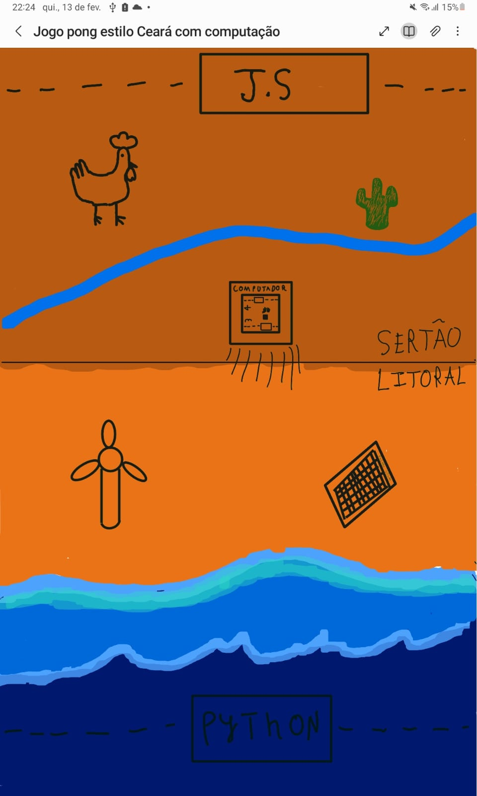

# Relatório - Reinventando Pong

## 1. Introdução  
A atividade proposta em sala tem o objetivo de estimular a criatividade dos alunos e destacar a importância do game design na criação de jogos, não se limitando apenas ao aspecto visual, mas abrangendo todas as etapas do desenvolvimento do game.
Nossa proposta de personalização do Pong está intrinsecamente ligada ao nosso estado de origem, o Ceará, representando suas duas principais regiões: uma área simbolizando a capital e outra retratando o sertão, com elementos característicos de cada localidade e com a integração de tecnologia.

 
---

## 2. Pesquisa e Análise Inicial  
&nbsp;&nbsp;A técnica do Framework MDA oferece uma estrutura para compreender como os diferentes elementos de um jogo se interligam e afetam a experiência do jogador, dividindo-os em três principais componentes: mecânicas, dinâmica e estética.
Mecânicas

&nbsp;&nbsp;*As mecânicas referem-se principalmente ao modo de jogar, às regras do jogo e aos controles. No caso do Pong, os jogadores controlam uma barra vertical (movendo-se para cima e para baixo). Nossa versão é projetada para dois jogadores, aumentando a competitividade.*

A bola, que na nossa personalização representa um computador, quica nas bordas superiores e inferiores e se direciona para um dos jogadores. A barra lateral, personalizada com as linguagens de programação Python e JavaScript, deve ser utilizada para rebater a bola ao adversário. O objetivo do jogo é evitar que a bola ultrapasse a defesa do jogador.
Dinâmica

A dinâmica surge da interação do jogador com as mecânicas. Assim, o jogo se torna um duelo divertido entre os participantes, com o ritmo aumentando conforme a bola ganha velocidade. Os jogadores devem utilizar estratégias de ataque e defesa, contando também com os objetos de buffs (como a galinha, cactos, turbina eólica e placa solar) para influenciar a partida.
Estética

A estética refere-se à experiência emocional proporcionada pelo jogo. Em Pong, as emoções são intensificadas pela competição, pela utilização dos objetos de buffs, pelo entendimento completo das mecânicas e pela satisfação gerada ao vencer a partida.

---

## 3. Proposta de Reinvenção  
*Explique as mudanças propostas para a nova versão do **Pong**, detalhando:*  

*Tema e Ambientação:

O contexto do novo jogo é inspirado no Ceará, explorando as diferenças de cenário entre a área urbana da capital e o interior do sertão.

*Personagens ou Elementos Visuais:

Não adicionamos nenhum personagem.

*Mudanças na Mecânica:

Sim, houve alterações na forma de jogar ao adicionarmos os buffs, que no jogo são: o cacto, a galinha, a turbina de energia eólica e as placas solares. Eles desempenham a mesma função, mas estão posicionados em lados diferentes: o cacto e a galinha no sertão, enquanto a turbina de energia eólica e as placas solares estão na capital.
A galinha e as placas solares adicionam uma bola falsa, desafiando o oponente a identificar a verdadeira. A galinha transforma a bola (representada por um computador) em um ovo e adiciona outra, enquanto a placa solar transforma a bola em uma esfera luminosa e também adiciona uma extra.
Já o cacto e a turbina eólica aceleram a bola: o cacto rebate a bola, enquanto a turbina eólica a impulsiona com o vento, tornando o jogo mais dinâmico e desafiador.

*Objetivo da Reinvenção:** O que a nova versão pretende explorar ou melhorar em relação ao original?*

A nova versão busca aprimorar a jogabilidade, a competitividade, a mecânica e o design, além de representar o estado do Ceará.

---

## 4. Tela Digital do Jogo  

Como o concept foi adaptado para o formato digital?

O concept foi digitalizado a partir da ferramenta online de design gráfico Canva.

Quais elementos visuais foram aprimorados?

Nosso design digital foi totalmente aprimorado, considerando a pouca habilidade de desenho dos integrantes da dupla.

O uso de cores, formas e layout foi pensado para reforçar que aspectos do jogo?

Com certeza, as cores, formas e o layout são fundamentais para transmitir com precisão a essência do jogo. Além de ser um jogo divertido e competitivo, ele tem o objetivo de representar a diversidade de biomas e a riqueza cultural do Ceará, destacando dois extremos: a capital e o sertão.

---

## 5. Reflexão e Aprendizados  
Quais foram os maiores desafios enfrentados durante o processo de criação?

Francisco: Fazer o cenário do pong

Gabriel: Pensar no novo conceito de pong

Que habilidades foram desenvolvidas ou aprimoradas ao longo da atividade?

Francisco: Criatividade e utilização do canva

Gabriel: criatividade e desenho

---

## 6. Referências (se houver)  
Referências: Ajuda do ChatGpt para correção de textos.

---
